# SyriaTel-Customer-Churn-Prediction

Author: Samuel Gichanga
# Business understanding
## Problem Statement
SyriaTel, a telecommunications company, is facing a high churn rate, with many customers discontinuing their services and switching to competitors. The company wants to address this issue by developing a customer churn prediction model. By analyzing the dataset, SyriaTel aims to gain insights into factors associated with churn, with the goal of reducing churn rate, increasing customer retention, and improving overall profitability.

## Specific Objectives
1. Identify the factors that are most likely to lead to customer churn.
1. Develop a model that can accurately predict which customers are at risk of churning.
1. Take proactive steps to retain customers who are at risk of churning.
## Data Understanding
The dataset provided information on the following features for each customer:
* US State
* Length of account
* Area code + phone numbers
* If the customer has an international plan
* If the customer has a voicemail plan
* No. of voicemail messages
* Breakdown of call minutes for day, evening, night, and international
* Breakdown of call charges for day, evening, night, and international
* Breakdown of no. of calls for day, evening, night, and international
* No. of calls to customer service
* If they have churned

### EDA
From the visualization of the features I realized a trend in the certain states churning more than others, so I plotted the no. of churns per state below.

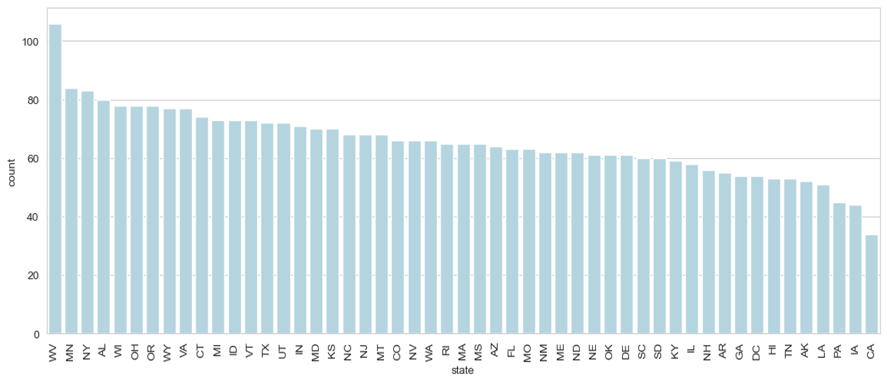

### Check imbalance in the data
We have classification problem so we need to check the balance of the given data.
|churn |	count	| percentage|
|-------|--------|--------|
|0	|2850|	85.508551|
|1	|483 |	14.491449|

Of the 3,333 customers in the dataset, 483 have terminated their contract. That is 14.5% of customers lost. The distribution of the binary classes shows a data imbalance. This needs to be addressed before modeling as an unbalanced feature can cause the model to make false predictions.

#### Barplot of Outcome vs Percentage
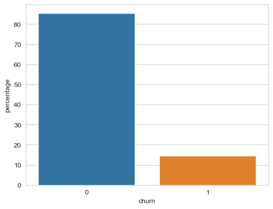
### Modeling
Since the goal is to reduce the number of customer churns, I want to reduce the number of number of customers that leave since they were not identified as a churn risk, or simply, the number false negatives. This means that we want to prioritize recall, but not make the model so inaccurate that all customers are identified as potential churners.
I built a model that can predict the customer churn based on the features in our dataset. The model will be evaluated on the recall score. Specifically, if it achieves an recall score of 80% or higher, it will be considered a success.

In order to achieve the targets stipulated in the project proposal, we will be using the following algorithms:

1. Logistic Regression
1. Decision Tree
1. Random Forest
1. XG Boost 

#### Model 1 - Logistic Regression (Confusion matrix)
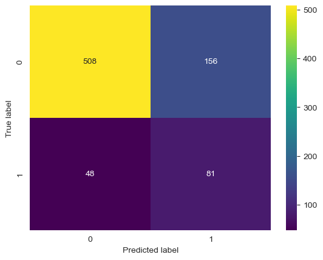

#### Model 2 - Decision Tree (Confusion matrix)
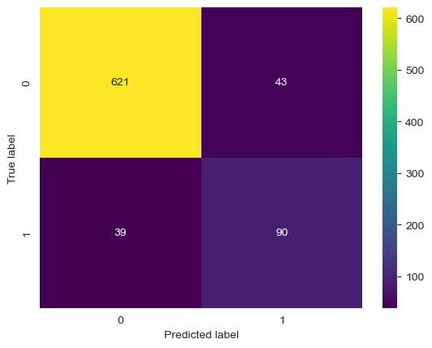

#### Model 3 Random Forest (confusion matrix)
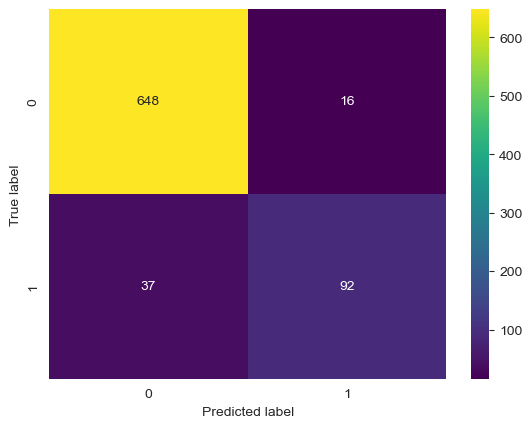

#### Model 4 - XGBoost (Confusion matrix)
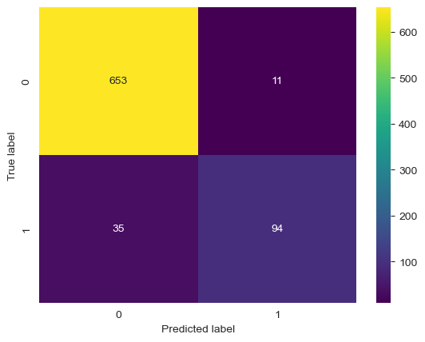

The best performing model was the grid search with XGBoost with a recall of 72.87%.
#### Top 10 feature importance graph
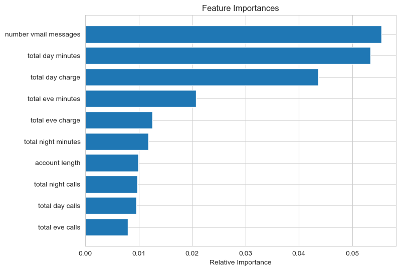

Looking at the first four features from the importance graph, developed some visualization of customers who stayed and those who churned.
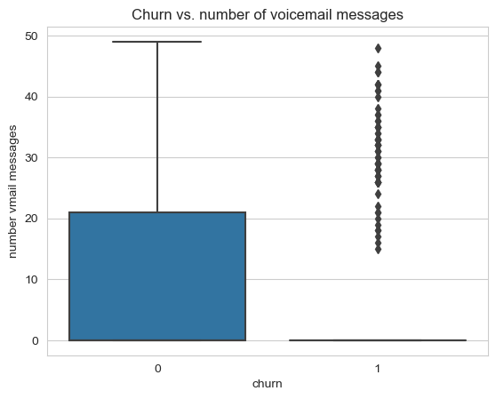
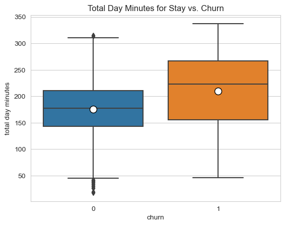
| Metric | No Churn | Churned |
| ---------- |:--------:|:--------:|
|Median|177.2 mins|222.9 mins|
|Mean|175.5 mins|209.8 mins|

Customers who spent more time on the phone during the day are more likely to churn. Customers who average over 200 minutes (outside the “box” for non-churners) should be considered higher risk for churning. Further investigation should be done if the needs of these heavy users of daytime minutes are being met.

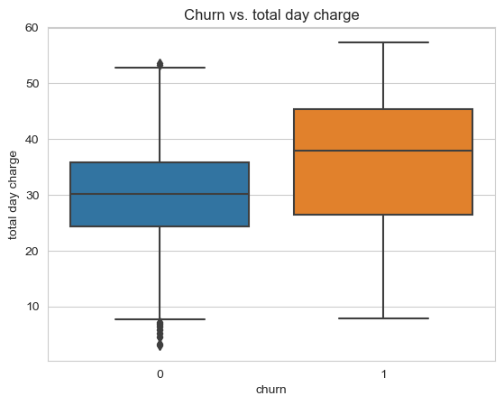
| Metric | No Churn | Churned |
| ---------- |:--------:|:--------:|
|Median|30.12| 37.89 |
|Mean| 29.84 | 35.66 |

Customers who are charged more money on the phone are more likely to churn. Customers who average 35 US dollars (outside the “box” for non-churners) should be considered higher risk for churning.

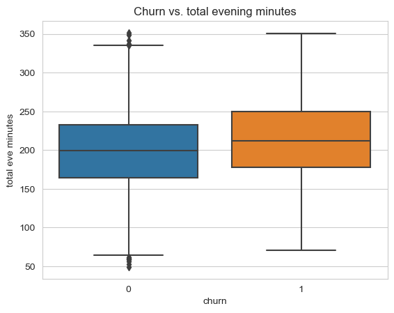
| Metric | No Churn | Churned |
| ---------- |:--------:|:--------:|
|Median|199.7 mins|211.6 mins|
|Mean|199.1 mins|213.2 mins|

Customers who spent more time on the phone during the evening are more likely to churn. Customers who average over 210 minutes (outside the "box" for non-churners) should be considered higher risk for churning. Further investigation should be done if the needs of these heavy users of night time minutes are being met.
### Conclusion
#### Findings
Within the dataset, it was evident that the SyriaTel business model was to charge customers based on the number of minutes that they used. However, it is evident that within the contributors of high customer churn, all of the factors are leading to a higher bill that is deterring the customer from continuing their phone plan.

#### Recommendations
Evaluate the pricing structure for day. Consider adjusting pricing plans or introducing discounted packages to address the higher charges associated with customers who churn.

Since Most of the customers are from West Virginia,Minnesota,NewYork,Alabama and Wisconsin, they should Offer discounts or promotional offers to the customers from this states. as these areas have a higher churn rate. This can help incentivize customers to stay with the company.

Develop customer retention strategies specific to high night time minute users. This could involve offering retention incentives or discounts to keep these customers loyal.

Personalized Offers; Use the information about high daytime minute usage to create personalized offers and incentives for customers who are at risk of churning. Tailor these offers to match their usage patterns and preferences.

### Deployment
For More Information, please review my full analysis in Jupyter Notebook or my presentation.

For any additional questions, please contact gichanga.samuel16@gmail.com

## Repository Structure
#### Main Page
    ├── README.md                              <- The top-level README for reviewers of this project
    ├── presentation.pdf                       <- PDF version of project presentation
    ├── analysis.ipynb                         <- master notebook
    ├── data                                   <- folder where data exists
    ├── images                                 <- folder where data visualizations and graphics are located
